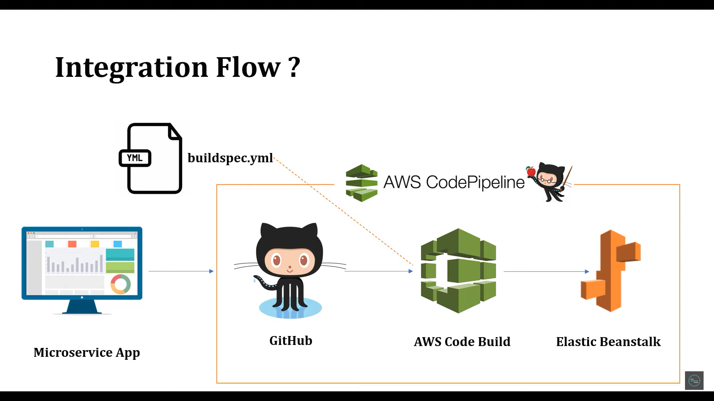

<h1>Creating a springboot mongodb docker image</h1>
1. pull mongodb from docker hub
> docker pull mongo:latest

2. run the mongodb instance (run mongo container)
> docker run -d -p 27017:27017 --name <MONGO_DB_INSTANCE_NAME> mongo:latest

3. maven install the spring app
> mvn clean install -Dskiptests

4. create Dockerfile and build an image from the dockerfile
> docker build -t <IMAGE_NAME> .

5. create docker-compose.yml file
> docker-compose up
> docker-compose down

6. services in docker-compose are the containers that will run

7. to test the collections/tables in the db instance
> docker exec -it samplemongodb bash
# mongo
# show dbs
# use recipedb
# show collections
# db.recipe.find().pretty()

<h1>Deploying to AWS (CI/CD)</h1>
We usually use elastic beanstalk for JAR deployment and RDS (sql) or dynamodb (nosql) 
for database deployment.
For a microservice application, these steps become repetitive as developers come across
more business logic to implement.

So the flow is: 

commit the microservice code to github and inform AWS Codebuild (by writing a YML, 
buildspec.yml file) to take automate the build process and deploy it to Elastic beanstalk.
This automation is taken care by AWS Codepipeline (analogous to jenkins)